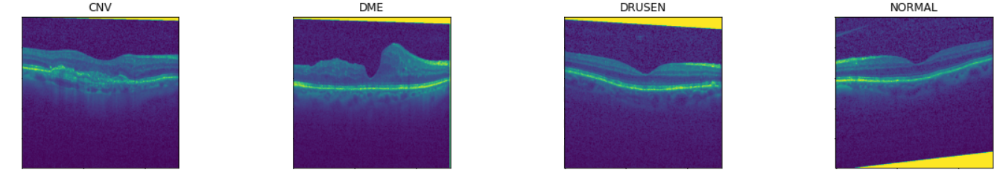

# Retinal Optical Coherence Tomography Scans   Image Classification and Clustering

The task is to classify (supervised learning) and cluster (unsupervised learning) images from a dataset containing retinal optical coherence tomography scans from healthy people and from people suffering from one of three different diseases.

More details can be seen in the PDF documentation, which is uploaded on this repository.

For this project, the methods I have tried are the following: 
  - Convolutional Neural Networks (supervised learning baseline), 
  - DBSCAN and K-means clustering (unsupervised learning methods to be compared)
  - features: raw pixel values, autoencoder (encoder as feature extractor), histogram of oriented gradients, VGG16 output (before the fully connected layers)

The following table presents the scores on the test data (accuracy and normalized mutual information) for the methods described in the documentation:

| Features | Method | ACC | NMI |
|:---:|:---:|:---:|:---:|
| - | Random chance | 25% | - |
| - | **Supervised CNN** | **98.7%** | - |
| Pixel values | K-means | 29.4% | 0.0092 |
| Pixel values | DBSCAN | 23.8% | 0.0086 |
| Encoder | K-means | 25.9% | 0.0018 |
| Encoder | DBSCAN | 24.2% | 0.0023 |
| HOG | K-means | 28.1% | 0.0041 |
| HOG | DBSCAN | 22.8% | 0.0002 |
| VGG | K-means | 41.7% | 0.1297 |
| VGG | DBSCAN | 25.3% | 0.0668 |
